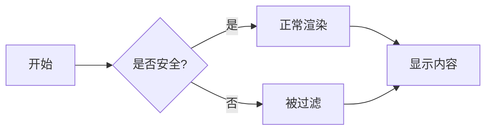

# XSS防护测试知识点

> **说明**：本文档包含XSS攻击测试代码，用于验证系统的安全防护能力。
> 请将以下内容复制到"新建知识点"页面进行测试。

---

## 测试1: Script标签注入

这是最常见的XSS攻击方式，直接注入`<script>`标签：

<script>alert('XSS Attack - Script Tag')</script>

**预期结果**：脚本不执行，无弹窗出现

---

## 测试2: 图片onerror事件

通过图片加载失败触发onerror事件：


**预期结果**：onerror事件被移除，无弹窗出现

---

## 测试3: 链接javascript伪协议

通过Markdown链接注入javascript:伪协议：

[点击测试XSS](javascript:alert('XSS Attack - JS Protocol'))

**预期结果**：链接被清理或无法点击，不执行JavaScript

---

## 测试4: 内联事件处理器

在HTML标签中注入onclick等事件：

<div onclick="alert('XSS Attack - Inline Event')">点击我触发XSS</div>

**预期结果**：onclick事件被移除，点击无反应

---

## 测试5: iframe注入

尝试注入iframe标签：

<iframe src="javascript:alert('XSS Attack - iframe')"></iframe>

**预期结果**：iframe标签被过滤，不渲染

---

## 测试6: SVG注入

通过SVG标签注入脚本：

<svg onload="alert('XSS Attack - SVG')">
  <circle cx="50" cy="50" r="40" />
</svg>

**预期结果**：onload事件被移除，SVG可能显示但不执行脚本

---

## ✅ 合法内容测试（应正常显示）

以下内容是合法的Markdown语法，应该正常渲染：

### 代码块测试

```javascript
// 这是合法的代码块，应该正常显示
const safeCode = "这不是XSS攻击";
console.log(safeCode);
alert('这只是代码块中的文本，不会执行');
```

```python
# Python代码块
def hello():
    print("Hello, World!")
```

### Mermaid图表测试



### 数学公式测试

这是一个简单的数学公式: $E = mc^2$

这是一个复杂公式:

$$
\int_{-\infty}^{\infty} e^{-x^2} dx = \sqrt{\pi}
$$

### 表格测试

| 测试项 | 状态 | 说明 |
|-------|------|------|
| Script标签 | ✅ | 应被过滤 |
| 合法代码块 | ✅ | 应正常显示 |
| Mermaid图表 | ✅ | 应正常渲染 |

### 引用测试

> 这是一段引用文本
> 应该正常显示

### 列表测试

**无序列表**：
- 项目1
- 项目2
  - 子项目2.1
  - 子项目2.2

**有序列表**：
1. 第一步
2. 第二步
3. 第三步

---

## 🎯 测试步骤

1. **复制内容**：选择并复制本文档的全部内容
2. **创建知识点**：进入系统，点击"+ 新建知识点"
3. **粘贴测试**：
   - 标题输入：`XSS防护测试`
   - 内容粘贴：本文档的全部内容
4. **保存**：点击"创建"按钮保存
5. **查看结果**：返回主页查看渲染效果

---

## ⚠️ 安全说明

**重要提示**：
- 本文档仅用于安全测试目的
- 所有XSS攻击代码应该被系统自动过滤
- 如果看到任何alert弹窗，说明存在安全漏洞
- 测试完成后可以删除此测试知识点

**预期结果**：
- ✅ 所有Script、onerror、onclick等危险代码被过滤
- ✅ 无任何alert弹窗出现
- ✅ 页面正常显示，无异常
- ✅ 代码块、Mermaid图表、数学公式正常工作

---

## 📋 DevTools检查指南

测试完成后，使用浏览器开发者工具验证：

1. **打开DevTools**：按F12或右键→检查
2. **切换到Elements标签**
3. **检查渲染后的HTML**：
   - 搜索`<script`标签 → 应该不存在
   - 搜索`onerror`属性 → 应该被移除
   - 搜索`onclick`属性 → 应该被移除
   - 搜索`javascript:`协议 → 应该被清理

4. **Console检查**：
   - 查看是否有错误信息
   - 确认无XSS相关警告

---

*本测试模板基于OWASP XSS测试指南创建*  
*最后更新：2025-11-10*
